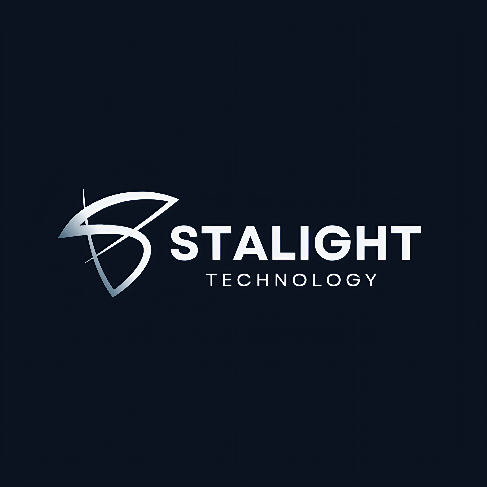

# 🚀 Growvo - Affordable Web, App, AI & Career Solutions

  

  <h2>Professional Freelance Services</h2>
  
<em>Transforming Ideas into Digital Reality</em>

  
  
  
  

---

## ✨ What We Offer

### 🌐 **Web Development**
- **Modern React Applications** - Built with latest technologies
- **Responsive Design** - Perfect on all devices
- **Performance Optimized** - Fast loading, SEO friendly
- **Custom Solutions** - Tailored to your specific needs

### 📱 **Mobile App Development**
- **Cross-Platform Apps** - iOS & Android compatibility
- **Native Performance** - Smooth user experiences
- **Intuitive UI/UX** - User-centered design approach
- **App Store Ready** - Complete deployment support

### 🤖 **AI & Machine Learning**
- **Intelligent Solutions** - Smart automation systems
- **Data Analytics** - Insights-driven decision making
- **Custom AI Models** - Specialized for your business
- **Integration Services** - Seamlessly connect with existing systems

### 💼 **Career Services**
- **Resume Writing** - Professional, ATS-optimized resumes
- **Career Counseling** - Personalized guidance
- **Interview Preparation** - Mock interviews and coaching
- **Job Search Strategy** - Comprehensive placement support

---

## 🎯 Our Approach

  <table>
    <tr>
      <td align="center">
        <h3>🎨 Design</h3>
        
Beautiful, modern interfaces that engage users

      </td>
      <td align="center">
        <h3>⚡ Performance</h3>
        
Lightning-fast applications with optimal UX

      </td>
      <td align="center">
        <h3>🔒 Security</h3>
        
Enterprise-grade security and data protection

      </td>
    </tr>
    <tr>
      <td align="center">
        <h3>📊 Analytics</h3>
        
Data-driven insights and performance tracking

      </td>
      <td align="center">
        <h3>🔧 Maintenance</h3>
        
Ongoing support and feature enhancements

      </td>
      <td align="center">
        <h3>💡 Innovation</h3>
        
Cutting-edge technologies and creative solutions

      </td>
    </tr>
  </table>

---

## 📋 Service Packages

### 🚀 **Small Package** - $299
- Basic website (5 pages)
- Mobile responsive design
- Contact form integration
- 1 month support

### ⚡ **Medium Package** - $799
- Advanced website (15 pages)
- Custom functionality
- Database integration
- 3 months support
- SEO optimization

### 💎 **Large Package** - $1,999
- Full-scale application
- Advanced features
- Third-party integrations
- 6 months support
- Performance monitoring

---

## 🛠️ Technologies We Use

  
  
  
  
  
  
  
  

---

## 📞 Get In Touch

  <h3>Ready to bring your ideas to life?</h3>
  
Contact us today for a free consultation

  
  

---

## 🌟 Why Choose Growvo?

- ✅ **Affordable Pricing** - Quality solutions at competitive rates
- ✅ **Fast Turnaround** - Quick delivery without compromising quality
- ✅ **Expert Team** - Experienced developers and designers
- ✅ **100% Satisfaction** - Money-back guarantee
- ✅ **Ongoing Support** - Continuous maintenance and updates
- ✅ **Modern Technologies** - Latest tools and frameworks

---

  <h3>🚀 Let's Build Something Amazing Together!</h3>
  
Visit <a href="https://growvo.com">growvo.com</a> to explore our portfolio and start your project today.

  

